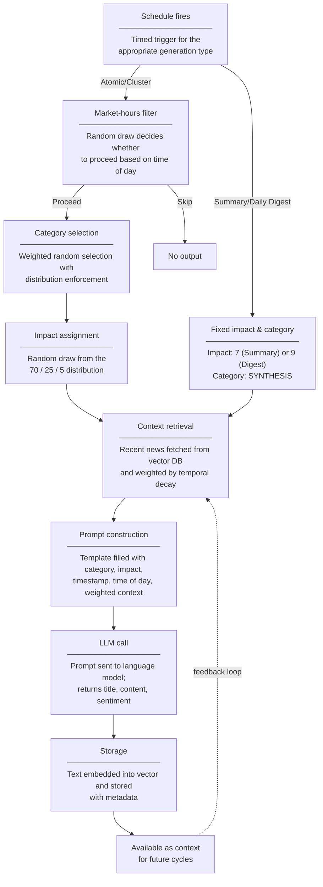

# News Generation - Concept

## Purpose

The World Engine generates a continuous stream of synthetic financial news that drives realistic price simulation in the exchange. It uses a large language model (LLM) to produce news that is temporally coherent, respects market hours, and balances across financial domains. The generated news is stored in a vector database so that other services — particularly the matching engine — can use it as context for price movements.

---

 

## Types of News

The system produces four kinds of output at different frequencies:

| Type | Frequency | What it produces |
|------|-----------|------------------|
| **Atomic News** | Every 2 minutes | A single news item (150–250 words) about one market event |
| **News Cluster** | Every 20 minutes | 3–5 related items sharing a common theme for narrative coherence |
| **Market Summary** | Every 2 hours | A 200–300 word synthesis of recent market trends |
| **Daily Digest** | Once daily at market close | A 500–800 word end-of-day recap of the entire trading session |

---

 

## Market Hours and Probabilistic Execution

Not every scheduled trigger actually produces news. The system recognises five time-of-day periods, each with an execution probability:

| Period | Time (EST) | Execution Rate |
|--------|-----------|----------------|
| Market Hours | 9:30 AM – 4:00 PM weekdays | 100% |
| Pre-Market | 7:00 – 9:30 AM weekdays | 30% |
| After-Hours | 4:00 – 8:00 PM weekdays | 20% |
| Overnight | 8:00 PM – 7:00 AM | 10% |
| Weekend | All day Saturday/Sunday | 10% |

---

 

## News Categories

News is classified into 12 categories organised in three tiers:

<table style="border-collapse: collapse;" border="1">
  <thead>
    <tr>
      <th>Tier</th>
      <th>Target Weight</th>
      <th>Category</th>
      <th>Description</th>
    </tr>
  </thead>
  <tbody>
    <tr>
      <td rowspan="5">Core Financial</td>
      <td rowspan="5">60% (12% each)</td>
      <td>Macroeconomics</td>
      <td>Central bank policy, GDP, inflation, employment</td>
    </tr>
    <tr>
      <td>Corporate Earnings</td>
      <td>Quarterly results, earnings revisions</td>
    </tr>
    <tr>
      <td>Mergers &amp; Acquisitions</td>
      <td>Deal announcements, M&amp;A flow</td>
    </tr>
    <tr>
      <td>Regulatory Policy</td>
      <td>Rule changes, compliance, regulatory actions</td>
    </tr>
    <tr>
      <td>Market Structure</td>
      <td>Trading halts, circuit breakers, infrastructure</td>
    </tr>
    <tr>
      <td rowspan="4">Peripheral Impact</td>
      <td rowspan="4">30% (7.5% each)</td>
      <td>Geopolitics</td>
      <td>Trade tensions, sanctions, political events</td>
    </tr>
    <tr>
      <td>Technology</td>
      <td>Innovation, disruption, tech sector dynamics</td>
    </tr>
    <tr>
      <td>Energy &amp; Commodities</td>
      <td>Oil prices, commodity markets, supply shocks</td>
    </tr>
    <tr>
      <td>Social Sentiment</td>
      <td>Consumer sentiment, market psychology, risk appetite</td>
    </tr>
    <tr>
      <td rowspan="2">Meta</td>
      <td rowspan="2">10%</td>
      <td>Analyst Commentary</td>
      <td>Upgrades, downgrades, consensus changes</td>
    </tr>
    <tr>
      <td>Synthesis</td>
      <td>Used only for summaries and digests</td>
    </tr>
  </tbody>
</table>

To prevent unrealistic clustering — for example, ten consecutive earnings headlines — the system enforces distribution rules over a **2-hour rolling window**:

1. **Hard cap at 40%:** If any category exceeds 40% of recent output, it is blocked entirely.
2. **Weight reduction at 30%:** Categories between 30–40% have their selection probability halved.
3. **Absence boost:** Core financial categories missing for 2+ hours get double selection probability.
4. **Sliding window:** The window rolls continuously rather than resetting on the hour, and is initialised from stored history on startup for continuity.

---

 

## Impact Scores

Each news item receives an impact score from 1 to 10, drawn from a skewed distribution:

| Tier | Score Range | Probability | Real-world analogy |
|------|-------------|-------------|-------------------|
| Low | 1–4 | 70% | Routine updates, minor contract wins |
| Medium | 5–7 | 25% | Sector rotations, analyst notes |
| High | 8–10 | 5% | Central bank decisions, major acquisitions |

The impact score controls how long the news item stays relevant through temporal decay (see next section). Market summaries are always assigned impact 7, daily digests always impact 9.

---

 

## Temporal Decay and Context Weighting

When generating new news, the LLM receives recent context — but older or less important items should matter less. The system achieves this through **exponential decay**:

$$
\text{weight} = e^{-\lambda \cdot \text{age in hours}}
$$

The decay rate $\lambda$ depends on impact:

| Impact | $\lambda$ | Half-life |
|--------|-----------|-----------|
| High (8–10) | 0.1 | ~7 hours |
| Medium (5–7) | 0.3 | ~2.3 hours |
| Low (1–4) | 0.7 | ~1 hour |

High-impact news (e.g. a central bank announcement) retains 90% of its weight after one hour and still has ~50% after seven hours. Low-impact news drops to half-weight within an hour.

### Context Windows

On top of decay, a **window weight** is applied:

- Items within the **primary window** (e.g. last 2 hours): full weight (×1.0)
- Items within the **secondary window** (e.g. 2–6 hours ago): reduced weight (×0.3)
- Items beyond both windows: minimal weight (×0.1)

The final weight is: `decay weight × window weight`. All weights are then normalised to sum to 1.0, giving the LLM a properly scaled importance ranking of the top ~20 context items.

Different generation types use different window sizes — atomic news looks back 2 hours primarily, clusters look back 4, and the daily digest spans the entire trading session.

---

 

## Generation Pipeline

Every generation follows one of two paths depending on the news type:

The stored item immediately becomes available as context for future generation cycles, creating a self-reinforcing loop of coherent market narrative.

---

 

## Catch-up Generation

If the system goes offline and restarts, it can **replay missed scheduled events** to fill the gap:

1. On startup, query the vector database for the timestamp of the most recently stored news item.
2. Calculate all scheduled events that were missed between that timestamp and the current time.
3. Replay each missed event in chronological order, applying the same market-hours probability filter.
4. Generated items receive the historical timestamp they would have had, preserving timeline continuity.
5. Once caught up, resume normal real-time scheduling.

This ensures the matching engine always sees a continuous, gap-free news timeline.

---

## Thread Concept (Planned)

A future enhancement will group related news items into **story threads** — for example, collecting all news about "Fed Rate Decision" under a single thread identifier. This is architecturally prepared (news items carry a thread identifier field, currently unused) but not yet active. When implemented, it will improve narrative tracking, context retrieval, and summary quality.
